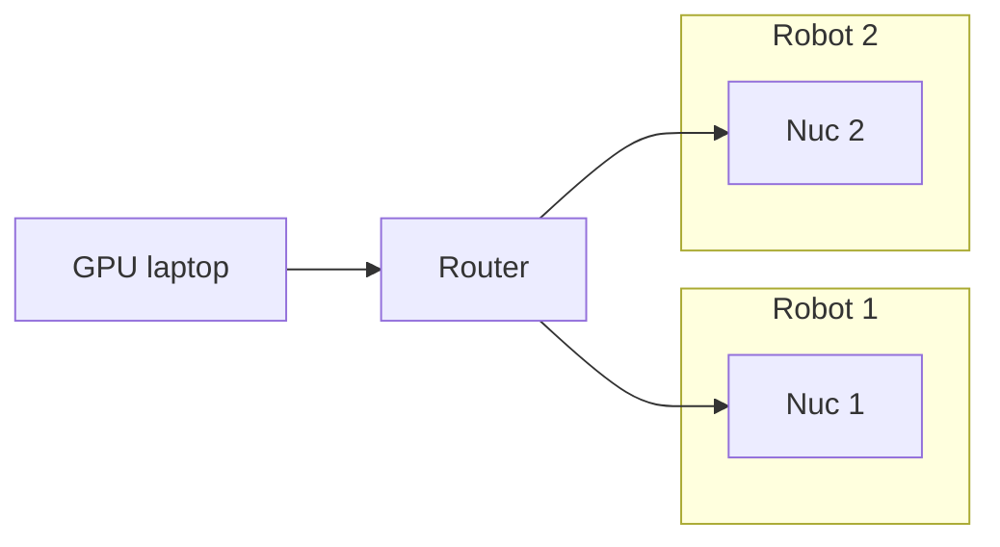

## Kinova Gen3 Controller

Redis driver for the Kinova Gen 3 robot. The driver consists of a low level c++ joint position controller running at 1 kHz and a higher level python IK controller running at 100 Hz. 


## Quick Start
1. IMPORTANT: set the correct initial joint configuration for your setup by changing the value of `q_command` in the `move_home_bimanual_setup` function in `kinova_driver.cpp`! This is very important as our initial joint configuration may not work for you. Alternatively, use the `move_home` function instead to move the robot to the default home position provided by the Kinova API.
2. Edit `config/robot_config.json` with the correct IP addresses for your setup (see Configuration section)
3. Run the low level c++ driver (e.g. for robot 1)
   ```bash
   ./bin/kinova_driver --robot 1 --config ../config/robot_config.json
   ```

4. In another terminal window, run the higher level IK controller (e.g. for robot 1)
    ```bash
    python src/kinova_controller.py --robot 1 --config config/robot_config.json
    ```

5. Send commands to the IK controller by setting the appropriate redis keys (see Redis Keys section)

## Installation
1. Setup a conda env
```
conda create -n kinova python=3.10
conda activate kinova
pip install -r requirements.txt
```
2. Install additional requirements
```
sudo apt-get install -y nlohmann-json3-dev
```
Install pinnochio using these instructions: https://stack-of-tasks.github.io/pinocchio/download.html
   

3. Build the project:
```bash
mkdir build && cd build
cmake ..
make
```


## Configuration

This repo suports bimanual control of two Kinova Gen 3 arms, connected using the following configuration. 


Each NUC controls one robot by running the low level c++ controller and higher level IK controller. These two controllers communicate using a local redis server running on each NUC independently. A central redis server runs on the GPU laptop and communicates with the IK controllers running on both NUCs. Command line flags should be used to specify which robot driver to launch. 

The robot IP addresses and Redis settings are set in `config/robot_config.json` as follows: 

The `robot_config.json` file contains these key parameters:

- **`ip_address`**: The IP address of each Kinova robot (e.g., "192.168.1.10")
- **`redis_host`**: The IP address of the computer controlling each robot (e.g., "192.168.1.11")
- **`central_redis_host`**: The IP address of the main computer sending commands to all robots (e.g., "192.168.1.15")
- **`port`**: Redis server port used for all redis servers (default: 6379)
- **`password`**: Redis server authentication password used for all redis servers


## Redis Keys 
The GPU laptop communicates to the robot controllers using redis and the following redis keys (examples shown for Robot 1 only): 

### Target commands
* `"kinova::bot1::ee_pos_des"`: end-effector target position
* `"kinova::bot1::ee_quat_wxyz_des"`: end-effector target orientation
* `"kinova::bot1::gripper_position_des"`: gripper target position

### Sensor values
* `"kinova::bot1::ee_pos"`: end-effector position
* `"kinova::bot1::ee_quat_wxyz"`: end-effector orientation
* `"kinova::bot1::gripper_position"`: gripper position
* `"kinova::bot1::q_s"`: joint positions


## Acknowledgement

This code base is adapted from the amazing [Tidybot++ repo](https://github.com/jimmyyhwu/tidybot2/tree/main) and some of the examples from the [Kinova Kortex api](https://github.com/Kinovarobotics/Kinova-kortex2_Gen3_G3L/tree/master). 
